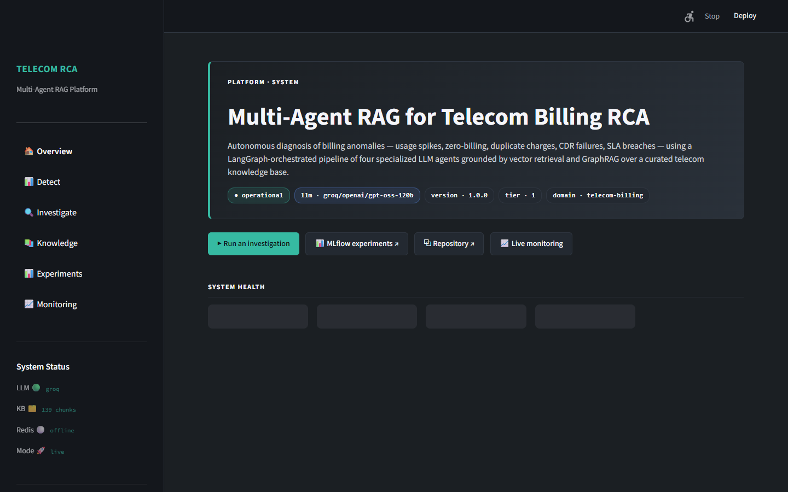
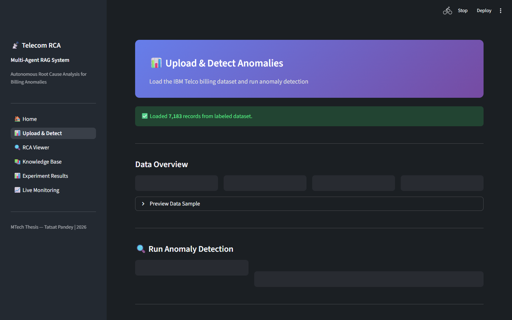
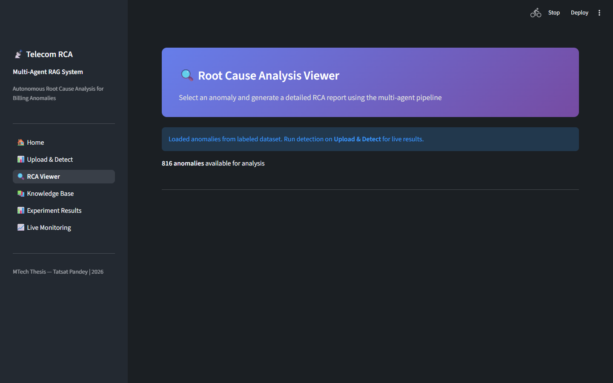
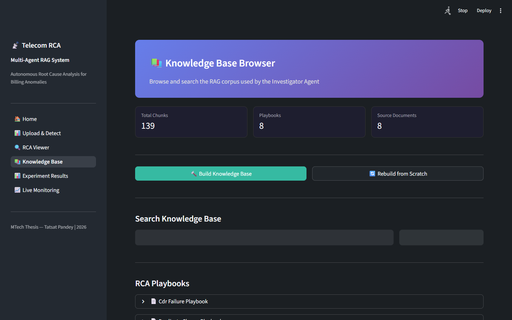
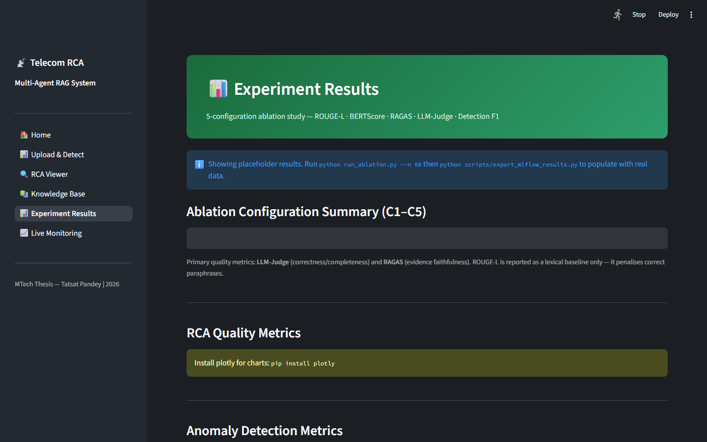
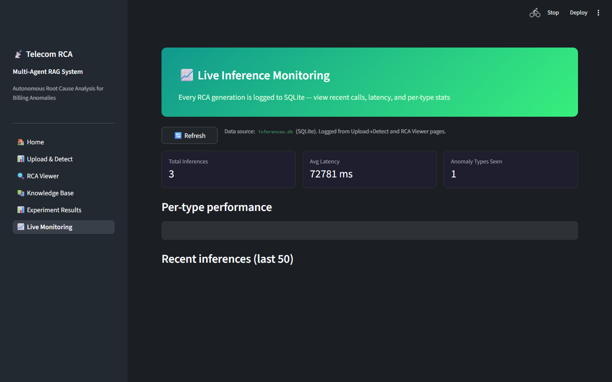

# Multi-Agent RAG for Telecom Billing RCA

M.Tech dissertation project — a multi-agent retrieval-augmented generation
system for root cause analysis of telecom billing anomalies.

## Documentation

| Document | What it covers |
|---|---|
| [docs/DESIGN.md](docs/DESIGN.md) | Design rationale: problem, objectives, design decisions and alternatives, architecture, and planned evaluation. **Start here.** |
| [SPEC.md](SPEC.md) | Delivery plan: week-by-week milestones and the mid-semester demonstration target. |
| [docs/diagrams/](docs/diagrams/) | Architecture, data-flow, agent-sequence, GraphRAG entity-relationship, and deployment diagrams. |
| [docs/GRAPHRAG_DESIGN.md](docs/GRAPHRAG_DESIGN.md) | Design of the graph-based retrieval component. |

The sections below are a build and usage guide. For the rationale behind each
choice, read [docs/DESIGN.md](docs/DESIGN.md) first.

## Overview

An end-to-end platform designed to detect anomalies in telecom billing data and
perform automated root cause analysis using a LangGraph multi-agent pipeline
backed by hybrid RAG (BM25 + dense + GraphRAG) and a critic/refinement loop.

## Architecture

| Layer | Components |
|-------|-----------|
| **Detection** | IsolationForest, statistical z-score, rule-based validators |
| **Retrieval** | ChromaDB (all-MiniLM-L6-v2, 384-dim), BM25, NetworkX GraphRAG, RRF fusion |
| **Agents** | LangGraph orchestrator → Investigator → Reasoner → Critic → Reporter |
| **LLM Router** | LiteLLM Router — Groq GPT OSS 120B primary → OpenRouter free fallback (GPT OSS 120B, Llama 3.3 70B, Qwen3 Coder) with automatic rate-limit failover |
| **Tracking** | MLflow experiments + Langfuse traces |
| **Frontend** | Streamlit 5-page dashboard |
| **API** | FastAPI REST endpoint |

---

## UI Screenshots

| Page | Preview |
|------|---------|
| **Overview** — platform status, LLM/KB health badges |  |
| **Upload & Detect** — dataset stats, IsolationForest run, anomaly distribution |  |
| **RCA Viewer** — anomaly picker, multi-agent pipeline, Critic explainability |  |
| **Knowledge Base** — playbook chunks, semantic search |  |
| **Experiment Results** — ablation configs C1–C5, quality + latency charts |  |
| **Live Monitoring** — per-inference latency and audit log |  |

---

## Datasets

### Public Datasets (committed / auto-downloaded)

| Dataset | Records | Source | Use |
|---------|---------|--------|-----|
| **IBM Telco Customer Churn** | 7,043 | [Kaggle](https://www.kaggle.com/datasets/blastchar/telco-customer-churn) | Primary billing anomaly detection — fields: tenure, MonthlyCharges, TotalCharges, Contract, InternetService |
| **Maven Telecom Churn** | 7,043 | [Maven Analytics](https://www.mavenanalytics.io/data-playground) | Secondary dataset with different feature distribution for cross-validation |
| **SEBD (Enterprise Billing)** | 54,000 | Synthetic (generated) | Primary demo dataset — generic billing schema with fault codes, segments, anomaly labels |

Download: `python scripts/download_datasets.py` (auto-fetches to `data/raw/`)

### Synthetic Enterprise Billing Dataset (SEBD)

SEBD is a **fully synthetic** dataset generated to mirror a *generic* enterprise-billing
schema. It uses no production data and contains no real identifiers — every value is
produced from a seeded RNG, so the output is deterministic and safe to commit. The
schema models the kinds of fields a billing pipeline emits:

```
SEBD Schema (generated, safe to commit)
───────────────────────────────────────
TXN_ID                 transaction id (1..N)
ACC_CODE               account code        (ACC-0001, ACC-0002, ...)
SVC_SKU                service SKU          (SKU-0001, SKU-0002, ...)
UNIT_COUNT             billable units
FAULT_CODE             fault label         (UNIT_EMPTY_FAULT, ...)
SEGMENT                customer segment    (SEGMENT_A, SEGMENT_B, ...)
PROC_STATUS            processing status   (PROCESSED, FAILED, ...)
```

**To (re)generate SEBD**:
```bash
python scripts/generate_sebd.py --output data/raw/sebd.csv --rows 54000
```

The system also works fully with the 3 public datasets above; SEBD is the primary
demo/evaluation source.

### Anomaly Injection (5 types)

`src/data/anomaly_injector.py` injects controlled anomalies into clean data for training/evaluation:

| Anomaly Type | What It Does | Example |
|-------------|--------------|---------|
| `zero_billing` | Sets MonthlyCharges=0 for active accounts | Fiber customer, 28mo tenure, $0 charge |
| `duplicate_charge` | Duplicates a billing row with same amount | Same customer billed twice in one cycle |
| `usage_spike` | Inflates usage metrics by 5–20× | CDR call_volume jumps from 100 → 1500 |
| `sla_breach` | Creates SLA violation pattern | Downtime > agreed SLA threshold |
| `cdr_mismatch` | CDR count ≠ billed count | 500 CDRs processed, only 200 billed |

### Ground Truth (60 curated RCAs)

`data/eval/ground_truth_rca/` contains 60 expert-written incident files (`incident_001.json` – `incident_060.json`), each with:
- `anomaly_type`, `affected_pattern`
- `root_cause` (expected answer)
- `supporting_evidence` (references to playbooks/SLAs)
- `recommended_action`, `severity`

These are used by `reeval_ablation.py` to score the multi-agent pipeline with ROUGE-L, BERTScore, and LLM-as-Judge.

### Knowledge Base Corpus (8 RCA Playbooks)

`data/corpus/rca_playbooks/` — domain knowledge the RAG retriever searches:

| Playbook | Covers |
|----------|--------|
| `zero_billing_playbook.md` | Zero-charge root causes, investigation steps |
| `duplicate_charge_playbook.md` | Double-billing patterns and resolution |
| `usage_spike_playbook.md` | Abnormal usage detection and CDR validation |
| `sla_breach_playbook.md` | SLA violation escalation procedures |
| `cdr_failure_playbook.md` | CDR ingestion pipeline failures |
| `revenue_assurance.md` | Revenue leakage detection framework |
| `incident_response_framework.md` | General incident triage process |
| `telecom_billing_overview.md` | Domain primer (billing cycle, mediation, rating) |

---

## Quick Start

```bash
# Clone and install
git clone https://github.com/tatsat3mutee/mtech-teleco-multiagent-project.git
cd mtech-teleco-multiagent-project
python -m venv .venv && .venv\Scripts\activate  # or source .venv/bin/activate
pip install -r requirements.txt

# Set up environment — only 2 keys needed
# GROQ_API_KEY  : https://console.groq.com/      (free)
# OPENROUTER_API_KEY : https://openrouter.ai/    (free, add $1 to unlock higher rate limits)
cp .env.example .env   # fill in GROQ_API_KEY and OPENROUTER_API_KEY

# Download public datasets
python scripts/download_datasets.py

# Build knowledge base (index playbooks into ChromaDB + build GraphRAG)
python scripts/build_graph_rag.py

# Launch Streamlit
streamlit run app.py
```

### Running with Demo Data (no API keys needed)

The system includes pre-generated results in `data/demo/sample_rca_results.json`.
Pages 4 (Experiment Results) and 5 (Live Monitoring) can display these without LLM calls.

For a full end-to-end run with real LLM inference:
```bash
python run_pipeline.py          # Single investigation
python run_ablation.py --quick  # 5-config ablation study
```

---

## Docker Deployment

```bash
docker compose up --build -d
```

4 services:
- **Streamlit** at `http://localhost:8501` — dashboard UI
- **FastAPI** at `http://localhost:8000` — REST API
- **Redis** at `http://localhost:6379` — LLM response cache + rate limiting
- **MLflow** at `http://localhost:5000` — experiment tracking

### External Services (free tier, optional)

| Service | Purpose | Config |
|---------|---------|--------|
| Neon.tech PostgreSQL | Inference audit log | `DATABASE_URL` in `.env` |
| Langfuse | LLM call tracing | `LANGFUSE_*` in `.env` |

---

## Tests

```bash
pytest tests/ -v          # Full suite (116 tests)
pytest tests/ -k "not llm"  # Skip tests requiring API keys
```

---

## Project Structure

```
src/
├── agents/       # LangGraph multi-agent orchestration (graph.py = DAG)
│   ├── graph.py           # LangGraph DAG definition
│   ├── investigator.py    # Retrieves evidence from KB
│   ├── reasoner.py        # Generates RCA hypothesis
│   ├── critic.py          # Scores + requests revision if low quality
│   ├── reporter.py        # Formats final report
│   ├── swarm_router.py    # Routes anomaly type → agent config
│   ├── llm_utils.py       # LiteLLM wrapper with failover
│   ├── state.py           # TypedDict state schema
│   └── prompts.py         # All agent prompt templates
├── data/         # Data loading and preprocessing
│   ├── loader.py              # IBM Telco + Maven loaders
│   ├── loader.py (load_sebd)     # Enterprise billing (SEBD) loader
│   ├── anomaly_injector.py    # 5-type anomaly injection
│   └── augmentor.py           # Data augmentation
├── detection/    # Anomaly detection
│   └── detector.py    # IsolationForest + rule pre-filter + z-score
├── evaluation/   # Evaluation framework
│   ├── metrics.py     # ROUGE-L, BERTScore, RAGAS, detection F1
│   ├── llm_judge.py   # 4-axis Likert LLM-as-Judge
│   └── stats.py       # Wilcoxon, bootstrap CI, paired-bootstrap
├── llm/          # LLM provider abstraction
│   ├── groq_provider.py, gemini_provider.py, deepseek_provider.py, kimi_provider.py
│   └── __init__.py    # Registry + auto-detect
├── rag/          # Retrieval-Augmented Generation
│   ├── hybrid_retriever.py  # BM25 + dense + RRF fusion
│   ├── graph_rag.py         # NetworkX entity-relation graph
│   ├── knowledge_base.py    # ChromaDB indexing/search
│   ├── chunker.py           # Semantic sentence-level chunking
│   ├── embedder.py          # all-MiniLM-L6-v2 wrapper
│   └── reranker.py          # Cross-encoder reranking
└── utils/        # Infrastructure utilities
    ├── inference_log.py  # Dual SQLite/PostgreSQL audit log
    ├── rate_limit.py     # Token-bucket rate limiter
    ├── cache.py          # Redis-backed LLM response cache
    ├── observability.py  # Langfuse integration
    ├── tracing.py        # Span/trace context propagation
    └── logging.py        # Structured logging

pages/              # Streamlit UI
├── 1_📊_Upload_Detect.py   # Upload CSV → detect anomalies
├── 2_🔍_RCA_Viewer.py      # Run multi-agent RCA on flagged rows
├── 3_📚_Knowledge_Base.py  # Browse/search indexed playbooks
├── 4_📊_Experiment_Results.py  # MLflow experiment comparison
└── 5_📈_Live_Monitoring.py    # Real-time inference log + metrics

api/                # FastAPI REST API
scripts/            # Build & evaluation scripts
├── build_graph_rag.py      # Index corpus → ChromaDB + build NetworkX graph
├── generate_sebd.py        # Anonymise internal billing CSV → SEBD
├── download_datasets.py    # Fetch public datasets
├── generate_demo_results.py # Pre-generate sample outputs
├── export_mlflow_results.py # Export experiment results to JSON
└── plot_results.py          # Generate evaluation plots

tests/              # 13 test files, 116 tests
data/
├── corpus/rca_playbooks/   # 8 domain playbooks (KB source)
├── eval/ground_truth_rca/  # 60 expert-written ground truth RCAs
└── demo/                   # Pre-generated sample results
models/             # Trained model artifacts (IsolationForest)
```

---

## Evaluation & Ablation

5 ablation configurations to measure contribution of each component:

| Config | Detection | Retrieval | GraphRAG | Critic Loop | Purpose |
|--------|-----------|-----------|----------|-------------|---------|
| **A (No-RAG)** | IF + Rules | None | ✗ | ✗ | Direct LLM baseline |
| **B (RAG-only)** | IF + Rules | BM25 + Dense | ✗ | ✗ | RAG without agent decomposition |
| **C (Single Agent)** | IF + Rules | BM25 + Dense | ✗ | ✗ | Single agent + RAG |
| **D (Multi-Agent)** | IF + Rules | BM25 + Dense + RRF | ✗ | ✓ | Proposed 4-agent system |
| **E (GraphRAG)** | IF + Rules | BM25 + Dense + Graph | ✓ | ✓ | Headline novelty — full system |

Metrics: ROUGE-L, BERTScore F1, LLM-Judge (4-axis Likert), Detection F1/Precision/Recall.
Statistical significance: Wilcoxon signed-rank + bootstrap 95% CI.

---

## References

See [docs/05_REFERENCES.md](docs/05_REFERENCES.md) for the full bibliography and
[SPEC.md](SPEC.md) for the weekly implementation plan.
