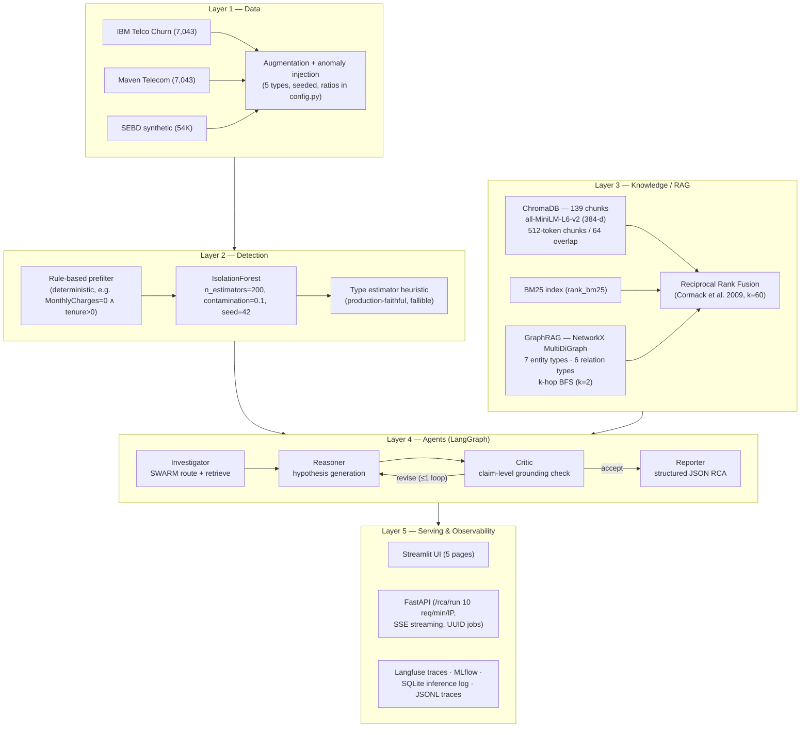
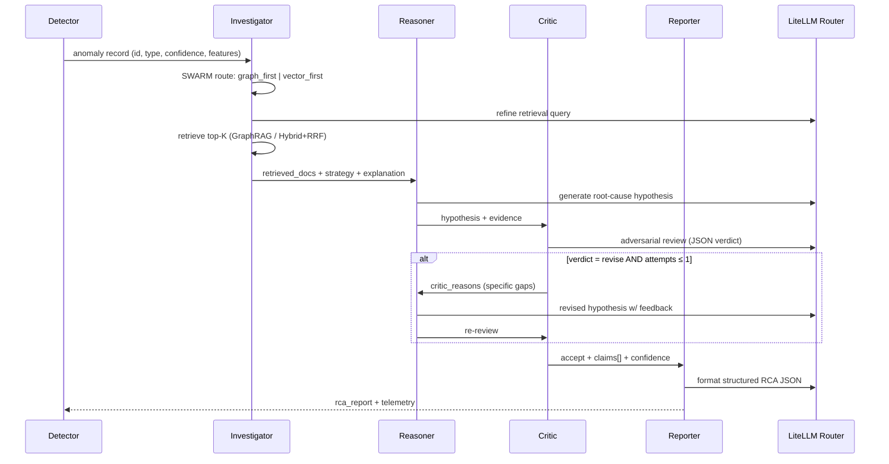
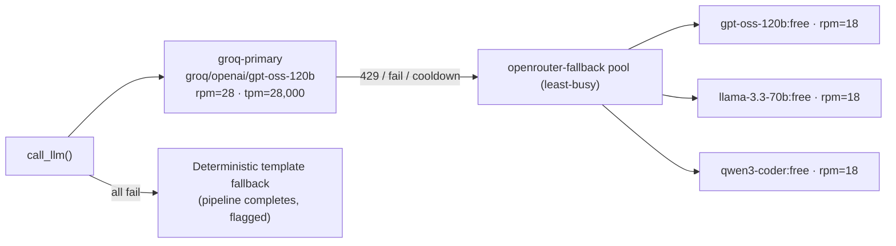
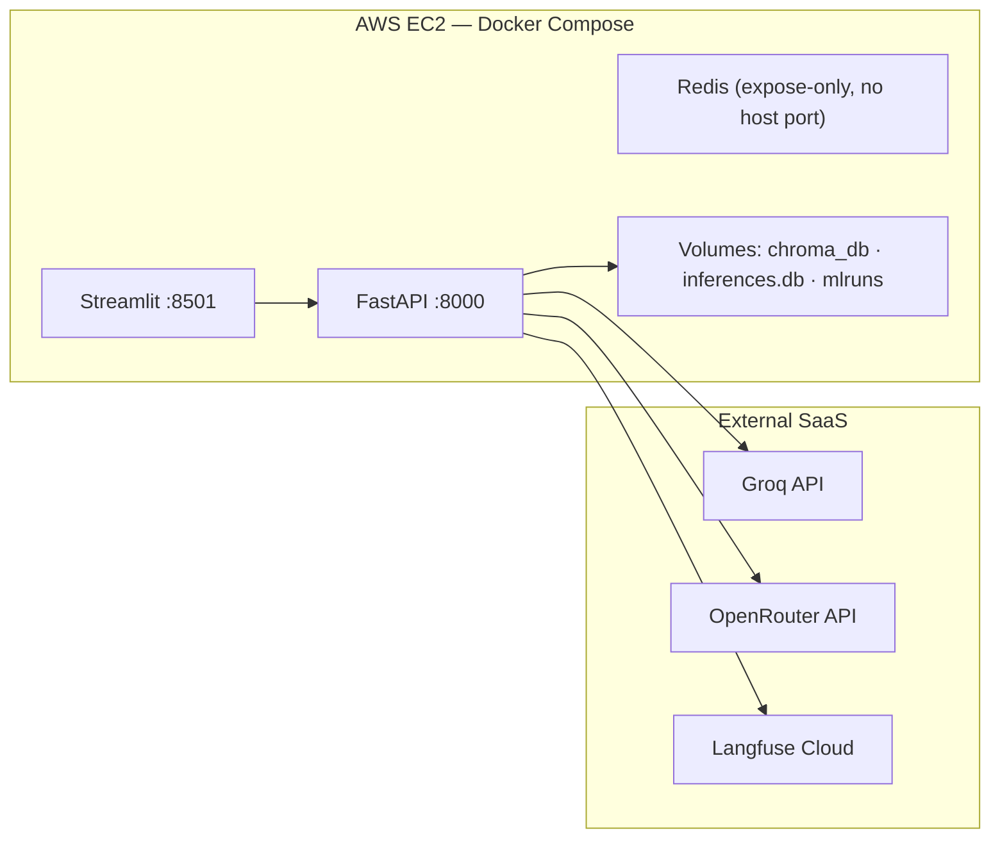

# System Architecture — Final Reference (v1.0)

> **Telecom Billing Anomaly RCA — Multi-Agent RAG System**
> MTech Dissertation, Tatsat Pandey, 2026.
> This is the authoritative architecture document for the final viva and dissertation
> Chapter 3. Every number here is verified against code (file references inline).
> Supersedes the mid-sem architecture snapshot in `docs/DESIGN.md` §5.

---

## 1. One-Paragraph Summary

The system detects billing anomalies in telecom customer data with a hybrid
**rule-prefilter + IsolationForest** detector, then explains each anomaly with a
**four-agent LangGraph pipeline** (Investigator → Reasoner → Critic → Reporter)
grounded in a curated RCA-playbook knowledge base retrieved through a
**SWARM-routed hybrid of GraphRAG (NetworkX causal graph) and vector+BM25 (RRF-fused)
search**. A **Critic agent** performs claim-level grounding verification to suppress
hallucination, with at most one bounded revision loop. All LLM traffic flows through a
**LiteLLM Router** (Groq primary, OpenRouter 3-model fallback pool) that enforces
provider rate limits proactively. Every run is instrumented end-to-end
(per-stage latency, token usage, provider events) and surfaced in a 5-page
Streamlit UI plus a rate-limited FastAPI service.

---

## 2. Layered Architecture (5 layers)



---

## 3. Agent Pipeline (LangGraph StateGraph)

Defined in `src/agents/graph.py` (`build_graph()`), executed via `run_pipeline()`.



### 3.1 Investigator (`src/agents/investigator.py`)
- Calls `swarm_router.get_retrieval_strategy(anomaly_type)`:
  - `graph_first`: `zero_billing`, `cdr_failure` — multi-hop causal chains benefit
    from graph traversal.
  - `vector_first`: `usage_spike`, `duplicate_charge`, `sla_breach` — pattern
    similarity; unknown types safely default here.
- LLM-refined search query → retrieval → writes `retrieval_strategy`,
  `routing_explanation`, `retrieved_docs`, `retrieval_count` into state.

### 3.2 Reasoner (`src/agents/reasoner.py`)
- Generates the root-cause hypothesis from anomaly + evidence.
- **Revision-aware**: when re-entered after a `revise` verdict, the prompt embeds
  the Critic's reasons and the previous hypothesis ("a senior reviewer flagged…").
- Deterministic type-specific fallback templates when LLM is unavailable
  (graceful degradation — pipeline never dies).

### 3.3 Critic (`src/agents/critic.py`) — hallucination control
The Critic is a **separately-prompted adversarial reviewer** ("senior telecom
billing SRE reviewing a junior engineer's RCA"). It returns strict JSON:

```json
{
  "verdict": "accept | revise",
  "reasons": ["…", "…"],
  "confidence": 0.87,
  "claims": [
    {"claim": "…", "grounded": true, "evidence": "zero_billing_playbook.md"},
    {"claim": "…", "grounded": false, "evidence": null}
  ]
}
```

Design properties:
| Property | Value | Why |
|---|---|---|
| Revision bound | `critic_attempts ≤ 1` (`should_revise()`) | No infinite loops; cost/latency bounded |
| Verdict criteria | revise only on contradiction, thin evidence, or ignored better cause | Avoids over-rejection churn |
| Claim-level grounding | every factual claim → grounded flag + evidence source | Auditable, surfaced verbatim in UI |
| Confidence clamp | `[0, 1]` | Robust to malformed LLM output |
| Degraded mode | LLM failure → `accept` @ confidence 0.5 | Fails safe, flagged for review |
| False-positive guard | `confidence < 0.5` ⇒ `review_required = true` | Human escalation, never auto-remediation |

### 3.4 Reporter (`src/agents/reporter.py`)
Produces the final structured JSON: `anomaly_id`, `anomaly_type`, `root_cause`,
`supporting_evidence[]`, `recommended_actions[]`, `severity`, `confidence_score`,
`summary` — with template fallback per anomaly type.

### 3.5 Pipeline state & telemetry (per run)
`run_pipeline()` captures, per run: `latency_ms` (end-to-end), `stage_timings`
(`investigator_ms`, `reasoner_ms`, `critic_ms`, `reporter_ms` — revision loops
accumulate), `token_usage` (ContextVar-isolated, concurrency-safe), full critic
block, and `revision_count`. Persisted to the SQLite/PostgreSQL inference log
(`src/utils/inference_log.py`) and MLflow.

---

## 4. Retrieval Subsystem

### 4.1 SWARM routing rationale
Routing is **deterministic per anomaly type**, not LLM-decided — cheap, testable,
explainable (the routing explanation is shown in the UI). Graph-first types have
documented multi-hop causal chains (e.g., zero billing ← rating engine ← rate
card ← cycle boundary); vector-first types are best matched by similarity to
prior incidents.

### 4.2 GraphRAG (`src/rag/graph_rag.py`, design in `docs/GRAPHRAG_DESIGN.md`)
- **Build**: rule-based + LLM-assisted entity/relation extraction over the 139-chunk
  corpus → NetworkX `MultiDiGraph` (pickled). 7 entity types (SYSTEM, COMPONENT,
  FAILURE_MODE, FIX, METRIC, SERVICE, CUSTOMER); 6 relations (CAUSES, DEPENDS_ON,
  FEEDS_INTO, TRIGGERS, FIXES, MONITORS).
- **Retrieve**: extract query entities → match nodes (exact→fuzzy) → k-hop BFS
  (k=2) → score nodes:

$$\text{score} = \alpha \cdot \text{relevance} + \beta \cdot \frac{1}{\text{hop distance}} + \gamma \cdot |\text{source chunks}|$$

- Map scored nodes back to chunks, dedupe, return top-K.

### 4.3 Hybrid retriever (`src/rag/hybrid_retriever.py`)
BM25 (lexical) + ChromaDB dense (semantic) rankings fused with **RRF**
(`1/(60 + rank)`), no score calibration needed. Optional cross-encoder reranker
(BAAI/bge-reranker-base) — skipped gracefully if unavailable.

### 4.4 Graph-traversal latency (examiner concern)
Worst case is bounded by design: BFS depth is fixed at k=2, the graph is in-memory
NetworkX (no network I/O), and retrieval is one stage inside `investigator_ms`
which is measured on every run. Empirically retrieval is milliseconds; LLM
inference dominates end-to-end latency (see `docs/VIVA_DEFENSE.md` §4 latency table).

---

## 5. LLM Layer — Rate-Limit-Aware Router

`config.py` `LITELLM_ROUTER_CONFIG` + `src/agents/llm_utils.py` `get_router()`.



| Control | Setting | Purpose |
|---|---|---|
| Groq rpm/tpm | 28 / 28,000 | Stay under Groq's 30/30K hard caps — **proactive**, not reactive |
| Routing strategy | `least-busy` | Spread fallback load across 3 free models |
| Retries | `num_retries=3`, `retry_after=2s` | Absorb transient 429s |
| Circuit breaker | `allowed_fails=2`, `cooldown_time=60s` | Stop hammering a failing provider |
| Last resort | template fallback in every agent | System degrades, never crashes |

**Lived validation** (not theoretical): Groq deprecated Llama-3.3-70B mid-project →
config-only swap to GPT-OSS-120B; OpenRouter retired free DeepSeek → fallback pool
updated. Zero code changes in agents.

**Judge independence**: evaluation judge defaults to a *different model family*
(Llama-3.3-70B via OpenRouter, temperature 0.0) than the generator (GPT-OSS-120B
via Groq) to mitigate self-affinity bias.

---

## 6. Serving Layer

### 6.1 FastAPI (`api/main.py`)
| Endpoint | Method | Protection |
|---|---|---|
| `/rca/run` | POST | **10 req/min/IP** (slowapi), optional `X-API-Key`, input validation (account_id regex ≤50 chars, anomaly_type enum, features ≤4 KB) |
| `/rca/status/{id}` | GET | UUID validation (anti-enumeration) |
| `/rca/stream/{id}` | GET | SSE per-step progress |
| `/health` | GET | liveness |

Jobs: in-memory store, max 1,000, LRU eviction, 1-hour TTL. CORS restricted via env.

### 6.2 Streamlit UI (5 pages)
1. **Upload & Detect** — dataset load, IsolationForest run, anomaly table.
2. **RCA Viewer** — pipeline trigger + report; **"⚖️ Critic Explainability" expander**
   (verdict badge, confidence, claim-by-claim ✅/❌ grounding table with evidence
   sources, revision count) and **red low-confidence banner** when
   `critic_confidence < 0.5` (false-positive guard).
3. **Knowledge Base** — 139-chunk browser + semantic search.
4. **Experiment Results** — ablation table/charts from real `results/ablation/` data.
5. **Live Monitoring** — inference log telemetry: latency, tokens, review-required
   rate, per-provider resilience events.

### 6.3 Observability stack
| Tool | Scope |
|---|---|
| Langfuse | Every LLM call: prompt/response, latency, tokens, session per RCA run |
| MLflow | Experiment runs: metrics per ablation config, RCA report artifacts |
| SQLite inference log | Production telemetry: per-stage ms, tokens, provider, review flag |
| JSONL tracer (`src/utils/tracing.py`) | Per-agent step traces in `traces/` |

---

## 7. Evaluation Architecture (summary — full details in dissertation Ch. 5)

- **7 ablation configs** (`config.py ABLATION_CONFIGS`): A `no_rag`, A2 `cot_baseline`,
  A3 `react_baseline`, B `rag_only`, C `single_agent_rag`, D `multi_agent_rag`
  (proposed), E `graph_rag` (headline novelty).
- **Blind mode default**: configs receive the *detector-estimated* anomaly type
  (fallible heuristic), not oracle labels — production-faithful, avoids leakage.
- **Metric hierarchy** (deliberate, examiner-aligned):
  1. **LLM-as-Judge** — 4-axis Likert (correctness, groundedness, actionability,
     completeness), independent judge model, temperature 0.
  2. **RAGAS-style** — faithfulness (atomic claim verification) + answer relevancy
     (reverse-question embedding similarity).
  3. **BERTScore** — semantic similarity baseline.
  4. **ROUGE-L** — *lexical baseline only*, disclosed as penalising valid paraphrases.
- **Statistics**: bootstrap 95% CIs, paired bootstrap p-values, Wilcoxon signed-rank,
  Benjamini–Hochberg FDR correction, Cohen's d (`src/evaluation/stats.py`).
- **Ground truth**: 60 incidents (12/type), authored independently of the
  injection rules.

---

## 8. Deployment View



Deployment target: single AWS EC2 `t3.medium` (see `docs/AWS_DEPLOY.md`) — EBS
persists ChromaDB/`inferences.db` across stop/start; both are rebuildable/disposable
demo state (documented in risk register OP-7). Memory footprint ~1.5–1.8 GB.

---

## 9. Quality Engineering

- **116 automated tests**, all passing offline (~4 min): agents, router fallback,
  critic parsing, chunker, hybrid retriever, GraphRAG, judge, metrics, stats.
- Security hardening: API key auth (optional), CORS allowlist, input validation,
  UUID job IDs, payload caps, request rate limits.
- Reproducibility: `RANDOM_SEED=42` everywhere; seeded anomaly injection;
  deterministic judge (T=0).

---

## 10. Design Decisions Index (for viva cross-reference)

| # | Decision | Alternative rejected | Rationale |
|---|---|---|---|
| D1 | LangGraph StateGraph | CrewAI / AutoGen | Explicit conditional edges → auditable critic loop |
| D2 | Bounded critic (≤1 revision) | Unbounded self-refine | Cost & latency bound; diminishing returns after 1 loop |
| D3 | Deterministic SWARM routing | LLM-based routing | Free, testable, explainable; no extra LLM call |
| D4 | NetworkX GraphRAG | Neo4j | Zero infra for thesis scale (139 chunks); Neo4j = future work |
| D5 | RRF fusion | Weighted score fusion | No score calibration; rank-only robustness |
| D6 | LiteLLM Router w/ rpm caps | Naive retry-on-429 | Proactive shaping beats reactive backoff (lived Groq timeout) |
| D7 | LLM-Judge + RAGAS headline | ROUGE-L headline | Lexical metrics penalise valid paraphrases (examiner-aligned) |
| D8 | Blind-mode ablation | Oracle anomaly types | Production-faithful; avoids type leakage inflating results |
| D9 | Human escalation on low confidence | Auto-remediation | False-positive trap: system must fail safe |
| D10 | ContextVar token accounting | Global counters | Concurrency-safe under parallel API jobs |
