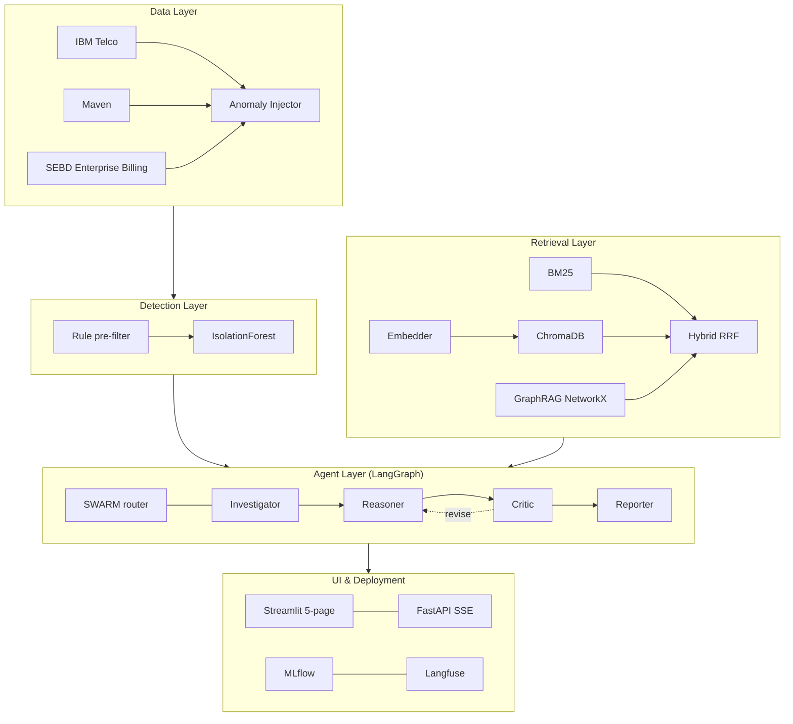

# Design Document — Multi-Agent RAG for Telecom Billing Root-Cause Analysis

This document sets out the design for an automated root-cause analysis (RCA) system
for telecom billing anomalies. It covers the problem and motivation, the objectives
and scope, the requirements, the architectural decisions and their rationale, the
system architecture, the data strategy, the planned evaluation methodology, and the
known risks. It is a design and intent document: it states what the system is
designed to do and how its performance will be measured. 

---

## 1. Problem and Motivation

Telecom billing pipelines are long, multi-stage, and tightly coupled: usage events
flow from network elements through mediation, rating, charging, and invoicing before
a customer ever sees a bill. When a billing anomaly occurs — a customer charged ₹0
for a month of active service, a duplicate charge, an unexplained usage spike — the
visible symptom is almost always the last link in a causal chain. A zero-value
invoice, for example, frequently originates several stages upstream: a mediation job
drops call detail records, the rating engine then has nothing to rate, and the empty
charge only surfaces at invoicing. Establishing the true root cause therefore
requires tracing the fault across several systems and a large body of operational
runbooks — a process that is slow and heavily dependent on engineer experience.

Two obvious automation approaches are insufficient on their own:

- **A direct large language model query** ("here is the anomaly, what is the root
  cause?") produces fluent but frequently incorrect answers and offers no way to
  verify the source of any claim. For a billing system, an unauditable answer is
  unusable.
- **Conventional retrieval-augmented generation (RAG)** over the runbooks improves
  grounding but returns disconnected passages. It cannot *follow* a causal chain such
  as CDR → Service → SLA → Refund, which is precisely what makes RCA difficult.

The system is consequently designed around two properties that these approaches
lack. It must be **grounded** — every hypothesis traceable to source evidence — and
**relational** — able to traverse the causal relationships between domain entities.
These two requirements motivate the two central design choices: a multi-agent
pipeline with an explicit verification step, and graph-based retrieval (GraphRAG).

## 2. Objectives and Scope

### 2.1 Objectives
1. Detect anomalous billing records without labelled production data, using
   unsupervised methods.
2. Ground every root-cause hypothesis in cited evidence, so that outputs are
   auditable rather than speculative.
3. Provide retrieval that traverses domain relationships rather than returning only
   isolated passages.
4. Introduce an explicit critic stage that rejects weakly-grounded hypotheses before
   they are reported.
5. Quantify the contribution of each architectural component through a controlled
   ablation study.

### 2.2 In scope
The end-to-end pipeline from data ingestion and anomaly detection through grounded,
multi-agent RCA report generation, together with an offline evaluation harness.

### 2.3 Out of scope
- Live production deployment against an operator's systems; evaluation is offline.
- Use of proprietary incident data. All domain knowledge is drawn from public
  sources (3GPP, TM Forum).
- Multilingual support; the knowledge base is English-language only.
- Automatic learning of the knowledge-graph taxonomy. The taxonomy is curated;
  learned extraction is identified as future work.

### 2.4 Novel contributions
Three contributions distinguish this work from a conventional RAG pipeline:

1. **Relational retrieval for RCA (GraphRAG).** Retrieval that traverses a domain
   knowledge graph to follow causal chains, rather than retrieving isolated
   passages. This is the primary contribution.
2. **An evidence-gated multi-agent pipeline.** An explicit critic stage that rejects
   ungrounded hypotheses, making every reported root cause auditable.
3. **A controlled ablation methodology for agentic RAG.** A five-configuration study
   with statistical significance testing that isolates and quantifies the
   contribution of each architectural component.

## 3. Requirements

### 3.1 Functional requirements
| ID | Requirement |
|---|---|
| FR1 | Ingest billing data from multiple sources into a common normalised schema. |
| FR2 | Inject controlled, labelled anomalies to provide ground truth for evaluation. |
| FR3 | Flag and classify each anomaly by type, with an associated confidence score. |
| FR4 | Retrieve grounding evidence for each anomaly from the knowledge base. |
| FR5 | Generate a structured RCA report through the multi-agent pipeline. |
| FR6 | Verify each report against its supporting evidence before finalising it. |
| FR7 | Log every run for reproducibility, including configuration and LLM provider. |

### 3.2 Non-functional requirements
| ID | Requirement | Rationale |
|---|---|---|
| NFR1 Reproducibility | A clean clone re-runs end to end; the LLM provider and model are recorded with every run. | Results are meaningless without a recorded configuration. |
| NFR2 Auditability | Every hypothesis cites the evidence passages it used. | The core value proposition of the system. |
| NFR3 Cost | Runs on free or low-cost tiers; no paid infrastructure or GPU required. | Accessible deployment and reproduction. |
| NFR4 Offline safety | Core pipeline and test suite run with no LLM API key, using fallback templates and mock fixtures. | Development and CI without external dependencies. |
| NFR5 Portability | Deployable via Docker Compose without a GPU. | Portability across environments. |

## 4. Design Decisions and Rationale

The architecture is the result of a series of design decisions, each presented below
with its rationale and the alternatives that were considered and set aside. The
decisions follow the flow of data through the system.

### 4.1 Anomaly detection — Isolation Forest with a rule-based pre-filter
No labelled production anomalies are available, so supervised classification is ruled
out; detection must be unsupervised. The system uses an **Isolation Forest** as the
primary detector because it produces a continuous per-record anomaly score. That
score can be thresholded and ranked, which is required to drive the downstream,
confidence-based trigger into the agent pipeline. A lightweight rule-based pre-filter
sits in front of the model to catch trivially malformed records — for example, null
charges on an active account — so that model capacity is reserved for genuinely
ambiguous cases.

**Alternative considered — DBSCAN.** Density-based clustering was evaluated but set
aside: it is highly sensitive to its `eps` and `min_samples` parameters on billing
features whose scales differ widely, and it yields a discrete cluster label rather
than the continuous, rankable score the pipeline requires. It is retained only as a
comparison baseline.

### 4.2 Retrieval — hybrid lexical and dense, with rank fusion
Telecom runbooks contain many exact tokens — SLA names, fault codes, KPI labels —
that dense embeddings tend to conflate, while purely lexical search misses
paraphrased causal language. The system therefore fuses **BM25** (lexical) and
**dense** retrieval using **Reciprocal Rank Fusion (RRF)**. RRF is chosen because it
operates on rank position and so requires no calibration of score scales between the
two retrievers.

**Alternative considered — dense-only retrieval.** Simpler, but it loses exact-term
recall on the coded vocabulary that billing RCA depends on. It is retained as
ablation Config B to quantify the difference.

### 4.3 GraphRAG — relational retrieval (primary contribution)
The preceding choices still retrieve isolated passages. Telecom RCA, however, is
inherently relational: a diagnosis takes the form of a chain such as
`(RatingError) CAUSES (BillingError) AFFECTS (MobileData) BREACHES (AvailabilitySLA)`.
Flat retrieval returns each of these facts independently and leaves the task of
connecting them to the language model, which is a common source of hallucination.

The system instead extracts entities and relations from the domain playbooks into a
knowledge graph (NetworkX) and, at query time, traverses it: starting from the
entities present in the detected anomaly, it walks the graph a bounded number of hops
and retrieves the passages along that path. This reproduces the multi-hop reasoning
an engineer performs manually. GraphRAG is the headline configuration (ablation
Config E) and the primary novel contribution of the work. The full entity and
relation taxonomy and the extraction approach are specified in
[GRAPHRAG_DESIGN.md](GRAPHRAG_DESIGN.md).

**Alternative considered — vanilla RAG only.** It is the standard baseline and is
adequate for single-hop questions, but by construction it cannot perform multi-hop
traversal. The ablation is designed to test whether GraphRAG provides a measurable
advantage on multi-hop incidents.

### 4.4 Multi-agent pipeline with a critic loop
Rather than a single language-model call, RCA is decomposed into four cooperating
agents orchestrated with **LangGraph**:
**Investigator → Reasoner → Critic → Reporter**. Each stage is independently
inspectable, and the **Critic** acts as an explicit quality gate: a hypothesis that
is not supported by the retrieved evidence is returned to the Reasoner for revision
before any report is produced. This conditional loop converts an unverifiable
assertion into an evidence-backed claim, directly satisfying the auditability
requirement (NFR2).

**Alternatives considered.** A *single LLM call* (ablation Config A) provides no
grounding or review and serves as the floor baseline. A *free-form conversational
agent framework* was set aside in favour of LangGraph's explicit state graph, which
provides the deterministic, debuggable, testable transitions an auditable billing
system requires.

### 4.5 Anomaly-type-aware routing
Different fault classes have different evidence shapes: a CDR failure benefits from
graph traversal of the mediation-to-billing chain, whereas a duplicate charge is well
served by direct lexical lookup. Each anomaly type is therefore routed to the
retrieval strategy best suited to it (vector-first, graph-first, or hybrid) rather
than applying a single strategy uniformly.

### 4.6 Multi-provider LLM backend
The system accesses language models through **LiteLLM**, a unified OpenAI-compatible
interface, with an ordered provider fallback chain. This serves three requirements
simultaneously: the exact provider and model are recorded with each run
(reproducibility, NFR1); automatic failover keeps runs alive when free-tier rate
limits are reached (cost, NFR3); and the LLM-as-Judge evaluator can be assigned a
different provider from the generator, reducing same-model evaluation bias. Offline
fallback templates allow the pipeline and tests to run with no API key (NFR4).

### 4.7 Local-first stack
Vector storage (ChromaDB, in-process), embeddings (`all-MiniLM-L6-v2`), the knowledge
graph (NetworkX), and experiment tracking (MLflow) all run locally with no managed
services. This satisfies the cost and portability requirements (NFR3, NFR5): a clean
clone reproduces the entire data and retrieval stack offline, with only
language-model inference depending on an external provider.

## 5. System Architecture

The system is organised as a five-layer pipeline. A record flagged by the detection
layer triggers the retrieval layer; the retrieved evidence and the anomaly are then
passed to the agent layer, which produces a grounded RCA report. Evidence is always
introduced before the language model reasons, never after.

Supporting diagrams — data flow, agent sequence, the GraphRAG entity-relationship
model, and deployment — are maintained in [diagrams/](diagrams/) and mapped to the
corresponding dissertation chapters in [diagrams/README.md](diagrams/README.md).

| Layer | Responsibility | Defining design choice |
|---|---|---|
| Data | Ingest, normalise, and inject labelled anomalies | Public and synthetic sources (§6) |
| Detection | Flag, score, and classify anomalies | Isolation Forest + rule pre-filter (§4.1) |
| Retrieval | Ground hypotheses in domain evidence | Hybrid retrieval + GraphRAG (§4.2, §4.3) |
| Agents | Investigate, reason, verify, report | LangGraph pipeline + critic loop (§4.4) |
| UI / Deployment | Demonstrate, serve, and track runs | Streamlit / FastAPI, MLflow / Langfuse, Docker |

## 6. Data Strategy

| Dataset | Records | Role |
|---|---|---|
| IBM Telco Customer Churn | 7,043 | Primary feature source for anomaly detection |
| Maven Telecom Churn | 7,043 | Secondary distribution for cross-validation |
| SEBD (Synthetic Enterprise Billing) | 54,000 | Realistic billing schema (fault codes, segments), anonymised |

Because no labelled production anomalies are available, five controlled anomaly
classes — zero-billing, duplicate charge, usage spike, CDR failure, and SLA breach —
are injected using rule-based transforms to provide ground-truth labels for
evaluation.

Several data constraints are stated explicitly as part of the design, because they
bound the claims the evaluation can make:

- Because anomaly injection is rule-based, detection metrics are interpreted as an
  **upper bound** on performance rather than as production performance.
- The SLA-breach class carries a label-leakage risk, since its injection threshold
  derives from the same quantile the detector observes; per-type detection claims are
  qualified accordingly.
- The IBM Telco features are churn features and serve as a proxy for production
  billing KPIs.
- The SEBD dataset is synthesised from a real billing schema; the underlying
  production file is confidential and is never included in the repository. The system
  runs fully on the public datasets alone.

## 7. Planned Evaluation Methodology

This section defines the evaluation design and the success targets. It reports no
measured results; measured numbers belong in the results chapter, after the full
ablation has been run and significance-tested.

### 7.1 Ablation study
Five configurations isolate the contribution of each architectural decision:

| Config | Description | Component isolated |
|---|---|---|
| A | Direct LLM, no retrieval | Value of grounding at all |
| B | RAG only, no agents | Value of retrieval |
| C | Single agent + RAG | Value of agents over plain RAG |
| D | Multi-agent + RAG | Value of the critic-gated pipeline |
| E | Multi-agent + GraphRAG | Value of multi-hop graph retrieval |

### 7.2 Metrics
- **Detection:** Precision, Recall, F1, and ROC-AUC against the injected labels.
- **Retrieval:** RAGAS-style context recall, context precision, and faithfulness.
- **RCA output quality:** ROUGE-L and BERTScore for lexical and semantic overlap, and
  a four-axis LLM-as-Judge scoring correctness, groundedness, actionability, and
  completeness.

### 7.3 Ground truth
A curated corpus of 60 incidents (12 per anomaly type) provides expected root-cause
narratives. These narratives include realistic failure modes — for example, Kafka
rebalance replay and mTLS certificate expiry — and are authored independently of the
injection rules, so that retrieval-side evaluation is not contaminated by the rules
that generated the data.

### 7.4 Statistical method
Configuration comparisons are supported by bootstrap 95% confidence intervals,
paired-bootstrap p-values, and the Wilcoxon signed-rank test on the joint metric,
rather than by point estimates alone.

### 7.5 Success criteria (targets)
- **H1 — grounding helps:** configs B, C, D, and E outperform A on RCA quality.
- **H2 — agents help:** config D outperforms B on groundedness and actionability.
- **H3 — GraphRAG helps:** config E outperforms D on multi-hop incidents by a margin
  that survives the significance test.
- **Detection target:** F1 > 0.80 on injected anomalies, interpreted as an upper
  bound per §6.

## 8. Risks and Threats to Validity

| ID | Risk | Mitigation |
|---|---|---|
| R1 | Injected anomalies are too separable, inflating detection metrics | Detection reported as an upper bound; the core argument rests on the retrieval and RCA side |
| R2 | SLA-breach label leakage | Disclosed; per-type detection claims qualified |
| R3 | Churn features differ from production billing KPIs | Declared scope limit; SEBD provides a richer schema track |
| R4 | Single-author ground truth introduces circularity | Corpus authored independently of injection rules; SME review identified as future work |
| R5 | LLM-as-Judge bias toward verbose output | Temperature 0, explicit rubric, judge provider separable from generator |
| R6 | Small sample size (12 per type) | Significance testing on the joint metric; per-type claims withheld |
| R7 | Hand-curated graph taxonomy rather than learned | Declared scope; learned extraction identified as future work |

## 9. Delivery Plan

The week-by-week implementation schedule, milestones, and the mid-semester
demonstration target are defined in [../SPEC.md](../SPEC.md). This design document
states the intent and rationale; the schedule states the timeline.
