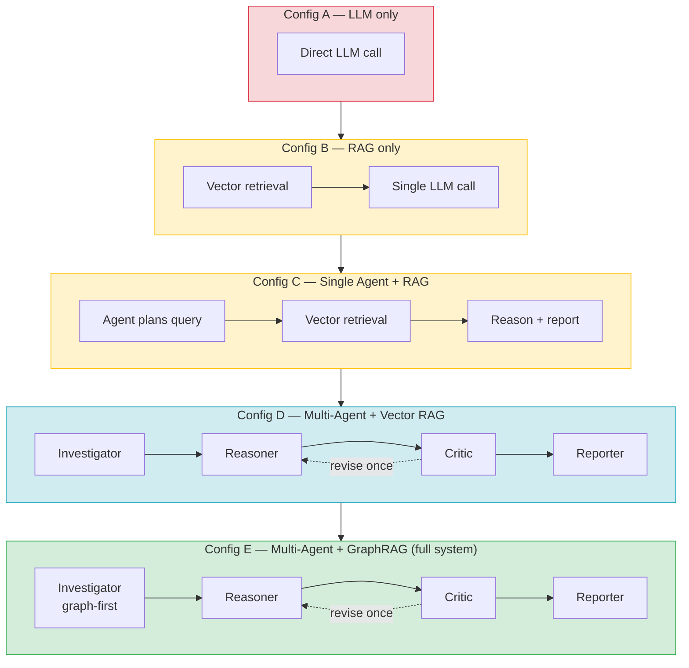

# Ablation Configuration Matrix

Each configuration adds one architectural component over the previous one, isolating
its contribution. **E − D** isolates the GraphRAG retrieval gain; **D − C** isolates the
multi-agent + Critic gain; **B − A** isolates the retrieval grounding gain.
