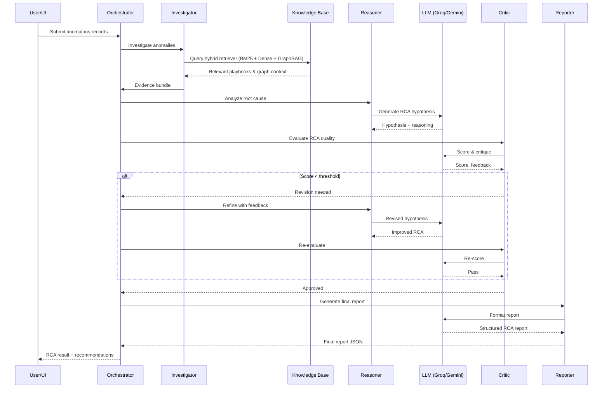

# Agent Sequence Diagram

```mermaid
sequenceDiagram
    participant U as User/UI
    participant O as Orchestrator
    participant INV as Investigator
    participant KB as Knowledge Base
    participant RES as Reasoner
    participant LLM as LLM (Groq/Gemini)
    participant CRI as Critic
    participant REP as Reporter

    U->>O: Submit anomalous records
    O->>INV: Investigate anomalies

    INV->>KB: Query hybrid retriever (BM25 + Dense + GraphRAG)
    KB-->>INV: Relevant playbooks & graph context

    INV->>O: Evidence bundle

    O->>RES: Analyze root cause
    RES->>LLM: Generate RCA hypothesis
    LLM-->>RES: Hypothesis + reasoning

    O->>CRI: Evaluate RCA quality
    CRI->>LLM: Score & critique
    LLM-->>CRI: Score, feedback

    alt Score < threshold
        CRI-->>O: Revision needed
        O->>RES: Refine with feedback
        RES->>LLM: Revised hypothesis
        LLM-->>RES: Improved RCA
        O->>CRI: Re-evaluate
        CRI->>LLM: Re-score
        LLM-->>CRI: Pass
    end

    CRI-->>O: Approved

    O->>REP: Generate final report
    REP->>LLM: Format report
    LLM-->>REP: Structured RCA report

    REP-->>O: Final report JSON
    O-->>U: RCA result + recommendations
```
