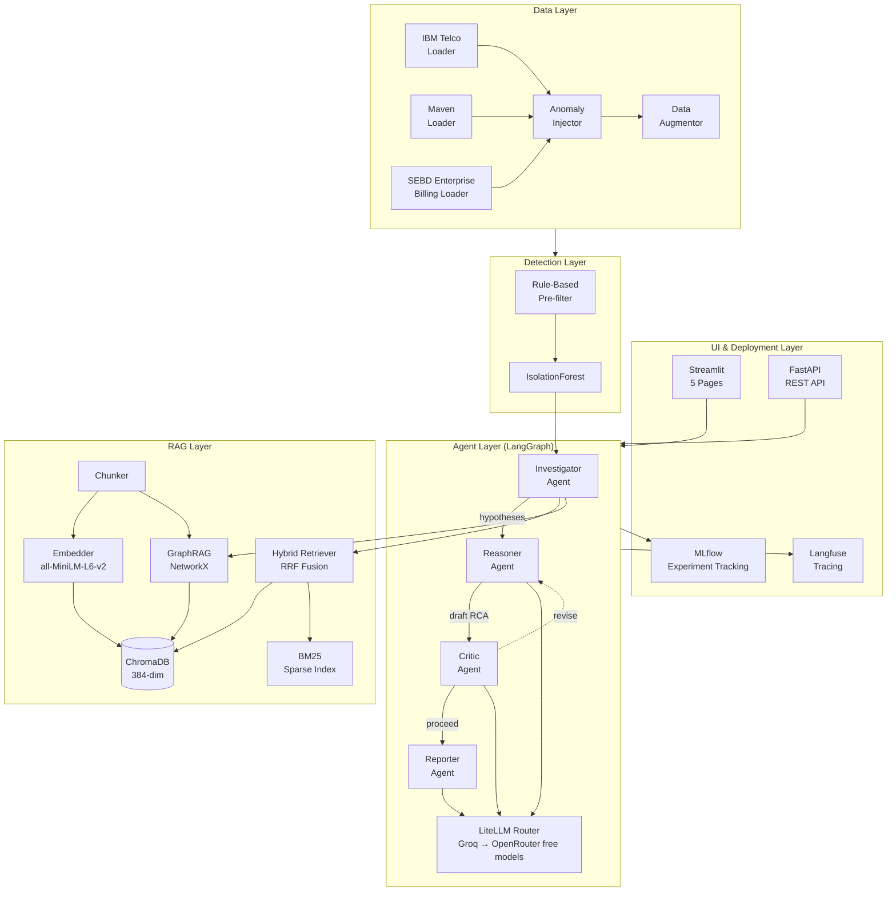

# System Architecture

```mermaid
graph TB
    subgraph UI["UI & Deployment Layer"]
        ST[Streamlit<br/>5 Pages]
        API[FastAPI<br/>REST API]
        MLF[MLflow<br/>Experiment Tracking]
        LF[Langfuse<br/>Tracing]
    end

    subgraph Agents["Agent Layer (LangGraph)"]
        INV[Investigator<br/>Agent]
        RES[Reasoner<br/>Agent]
        CRI[Critic<br/>Agent]
        REP[Reporter<br/>Agent]
        LLM[LiteLLM Router<br/>Groq → OpenRouter free models]
    end

    subgraph RAG["RAG Layer"]
        EMB[Embedder<br/>all-MiniLM-L6-v2]
        CHK[Chunker]
        CDB[(ChromaDB<br/>384-dim)]
        BM[BM25<br/>Sparse Index]
        HYB[Hybrid Retriever<br/>RRF Fusion]
        GR[GraphRAG<br/>NetworkX]
    end

    subgraph Detection["Detection Layer"]
        RB[Rule-Based<br/>Pre-filter]
        IF[IsolationForest]
    end

    subgraph Data["Data Layer"]
        IBM[IBM Telco<br/>Loader]
        MAV[Maven<br/>Loader]
        SEBD[SEBD Enterprise<br/>Billing Loader]
        INJ[Anomaly<br/>Injector]
        AUG[Data<br/>Augmentor]
    end

    %% Connections
    ST --> Agents
    API --> Agents
    Agents --> MLF
    Agents --> LF

    %% Agent pipeline (LangGraph state-graph flow)
    INV -->|hypotheses| RES
    RES -->|draft RCA| CRI
    CRI -->|proceed| REP
    CRI -.->|revise| RES

    %% Agent resource usage
    INV --> HYB
    INV --> GR
    RES --> LLM
    CRI --> LLM
    REP --> LLM

    HYB --> CDB
    HYB --> BM
    GR --> CDB
    EMB --> CDB
    CHK --> EMB
    CHK --> GR

    RB --> IF
    IF --> INV

    Data --> Detection
    IBM --> INJ
    MAV --> INJ
    SEBD --> INJ
    INJ --> AUG
```
