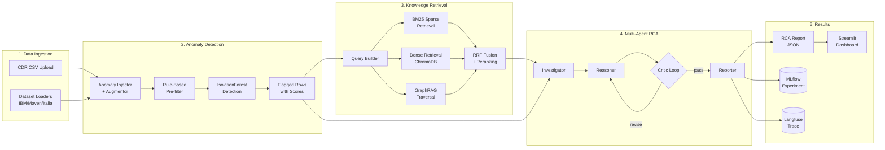

# Data Flow Diagram

```mermaid
flowchart LR
    subgraph Input["1. Data Ingestion"]
        CSV[CDR CSV Upload]
        DS[Dataset Loaders<br/>IBM/Maven/Italia]
    end

    subgraph Detect["2. Anomaly Detection"]
        INJ[Anomaly Injector<br/>+ Augmentor]
        PRE[Rule-Based<br/>Pre-filter]
        IF[IsolationForest<br/>Detection]
        FLAG[Flagged Rows<br/>with Scores]
    end

    subgraph Retrieve["3. Knowledge Retrieval"]
        QRY[Query Builder]
        BM25[BM25 Sparse<br/>Retrieval]
        DENSE[Dense Retrieval<br/>ChromaDB]
        GRAPH[GraphRAG<br/>Traversal]
        RRF[RRF Fusion<br/>+ Reranking]
    end

    subgraph Agent["4. Multi-Agent RCA"]
        INV[Investigator]
        RES[Reasoner]
        CRI{Critic Loop}
        REP[Reporter]
    end

    subgraph Output["5. Results"]
        JSON[RCA Report<br/>JSON]
        MLF[(MLflow<br/>Experiment)]
        TRACE[(Langfuse<br/>Trace)]
        UI[Streamlit<br/>Dashboard]
    end

    CSV --> INJ
    DS --> INJ
    INJ --> PRE --> IF --> FLAG

    FLAG --> QRY
    QRY --> BM25
    QRY --> DENSE
    QRY --> GRAPH
    BM25 --> RRF
    DENSE --> RRF
    GRAPH --> RRF

    RRF --> INV
    FLAG --> INV
    INV --> RES
    RES --> CRI
    CRI -->|revise| RES
    CRI -->|pass| REP

    REP --> JSON
    REP --> MLF
    REP --> TRACE
    JSON --> UI
```
