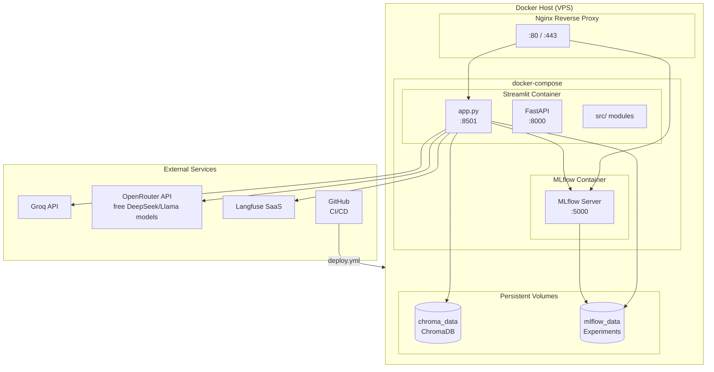

# Deployment Topology

```mermaid
graph TB
    subgraph Internet["External Services"]
        GROQ[Groq API]
        OPENR[OpenRouter API<br/>free DeepSeek/Llama models]
        LFSAAS[Langfuse SaaS]
        GH[GitHub<br/>CI/CD]
    end

    subgraph Host["Docker Host (VPS)"]
        subgraph NGINX["Nginx Reverse Proxy"]
            NG[":80 / :443"]
        end

        subgraph Docker["docker-compose"]
            subgraph ST["Streamlit Container"]
                APP[app.py<br/>:8501]
                FAPI[FastAPI<br/>:8000]
                SRC[src/ modules]
            end

            subgraph MLF["MLflow Container"]
                MLS[MLflow Server<br/>:5000]
            end
        end

        subgraph Volumes["Persistent Volumes"]
            CV[(chroma_data<br/>ChromaDB)]
            MV[(mlflow_data<br/>Experiments)]
        end
    end

    %% Connections
    NG --> APP
    NG --> MLS
    APP --> CV
    APP --> MV
    MLS --> MV

    APP --> GROQ
    APP --> OPENR
    APP --> LFSAAS
    APP --> MLS

    GH -->|deploy.yml| Host
```
