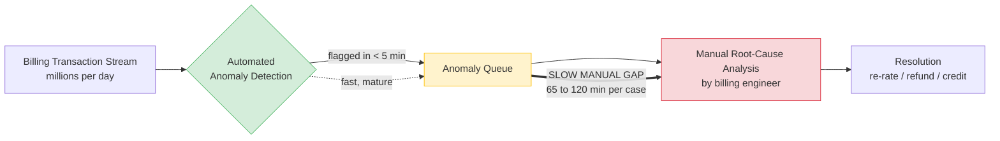

# Detection-to-Resolution Gap

The detection stage is fast and mature (under five minutes). The dominant cost is the
**manual root-cause-analysis gap** (65–120 minutes per case), which this dissertation
automates with a multi-agent GraphRAG pipeline.
