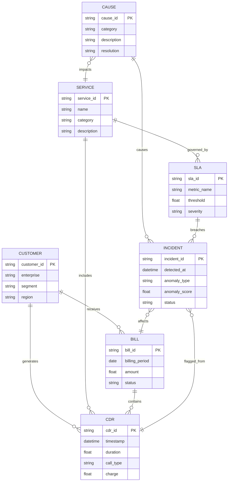

# GraphRAG Entity-Relationship Diagram

```mermaid
erDiagram
    SERVICE {
        string service_id PK
        string name
        string category
        string description
    }

    CUSTOMER {
        string customer_id PK
        string enterprise
        string segment
        string region
    }

    BILL {
        string bill_id PK
        date billing_period
        float amount
        string status
    }

    CDR {
        string cdr_id PK
        datetime timestamp
        float duration
        string call_type
        float charge
    }

    SLA {
        string sla_id PK
        string metric_name
        float threshold
        string severity
    }

    INCIDENT {
        string incident_id PK
        datetime detected_at
        string anomaly_type
        float anomaly_score
        string status
    }

    CAUSE {
        string cause_id PK
        string category
        string description
        string resolution
    }

    %% Relationships
    CUSTOMER ||--o{ BILL : "receives"
    CUSTOMER ||--o{ CDR : "generates"
    SERVICE ||--o{ CDR : "includes"
    SERVICE ||--o{ SLA : "governed_by"
    BILL ||--o{ CDR : "contains"
    INCIDENT }o--|| CDR : "flagged_from"
    INCIDENT }o--|| BILL : "affects"
    CAUSE ||--o{ INCIDENT : "causes"
    CAUSE }o--|| SERVICE : "impacts"
    SLA ||--o{ INCIDENT : "breaches"
```
